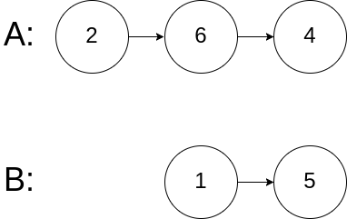

给你两个单链表的头节点 headA 和 headB ，请你找出并返回两个单链表相交的起始节点。如果两个链表不存在相交节点，返回 null 。

图示两个链表在节点 c1 开始相交：

题目数据 保证 整个链式结构中不存在环。

注意，函数返回结果后，链表必须 保持其原始结构 。

自定义评测：

评测系统 的输入如下（你设计的程序 不适用 此输入）：

intersectVal - 相交的起始节点的值。如果不存在相交节点，这一值为 0
listA - 第一个链表
listB - 第二个链表
skipA - 在 listA 中（从头节点开始）跳到交叉节点的节点数
skipB - 在 listB 中（从头节点开始）跳到交叉节点的节点数
评测系统将根据这些输入创建链式数据结构，并将两个头节点 headA 和 headB 传递给你的程序。如果程序能够正确返回相交节点，那么你的解决方案将被 视作正确答案 。

示例 1：

输入：intersectVal = 8, listA = [4,1,8,4,5], listB = [5,6,1,8,4,5], skipA = 2, skipB = 3
输出：Intersected at '8'
解释：相交节点的值为 8 （注意，如果两个链表相交则不能为 0）。
从各自的表头开始算起，链表 A 为 [4,1,8,4,5]，链表 B 为 [5,6,1,8,4,5]。
在 A 中，相交节点前有 2 个节点；在 B 中，相交节点前有 3 个节点。
— 请注意相交节点的值不为 1，因为在链表 A 和链表 B 之中值为 1 的节点 (A 中第二个节点和 B 中第三个节点) 是不同的节点。换句话说，它们在内存中指向两个不同的位置，而链表 A 和链表 B 中值为 8 的节点 (A 中第三个节点，B 中第四个节点) 在内存中指向相同的位置。

示例 2：

输入：intersectVal = 2, listA = [1,9,1,2,4], listB = [3,2,4], skipA = 3, skipB = 1
输出：Intersected at '2'
解释：相交节点的值为 2 （注意，如果两个链表相交则不能为 0）。
从各自的表头开始算起，链表 A 为 [1,9,1,2,4]，链表 B 为 [3,2,4]。
在 A 中，相交节点前有 3 个节点；在 B 中，相交节点前有 1 个节点。

示例 3：

输入：intersectVal = 0, listA = [2,6,4], listB = [1,5], skipA = 3, skipB = 2
输出：No intersection
解释：从各自的表头开始算起，链表 A 为 [2,6,4]，链表 B 为 [1,5]。
由于这两个链表不相交，所以 intersectVal 必须为 0，而 skipA 和 skipB 可以是任意值。
这两个链表不相交，因此返回 null 。

提示：

listA 中节点数目为 m
listB 中节点数目为 n
1 <= m, n <= 3 * 10^4
1 <= Node.val <= 10^5
0 <= skipA <= m
0 <= skipB <= n
如果 listA 和 listB 没有交点，intersectVal 为 0
如果 listA 和 listB 有交点，intersectVal == listA[skipA] == listB[skipB]

进阶：你能否设计一个时间复杂度 O(m + n) 、仅用 O(1) 内存的解决方案？

